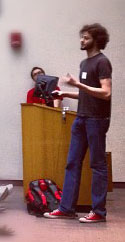



 
<a href="http://twitter.com/#!/russjf" class="zocial icon twitter" style="margin:5px;">twitter</a>
<a href="http://github.com/russfrank" class="zocial icon github" style="margin:5px;">github</a>

I'm a full-stack developer from New Jersey. I do everything from 
\*nix system administration to web backend development to mobile UI construction. 
I like clean code, simple design, and coffee. I love an elegant solution and 
I try to do things the Right Way™.

Currently I'm employed by Rutgers University, where I write the Rutgers Mobile app for iPhones, iPads, and Android devices.

Resume: [pdf](assets/resume.pdf)

-------

<ul>
   <li>{{ post.date | date_to_string }} &raquo; <a href="{{ BASE_PATH }}{{ post.url }}">{{ post.title }}</a></li>
</ul>
