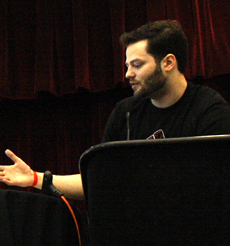



I'm a full-stack developer from New Jersey. I do everything from 
\*nix system administration to web backend development to mobile UI design. 
I like clean code, simple design, and coffee. I try to do things the Right Way™.

Currently I'm employed by Rutgers University, where I write the Rutgers Mobile app for iPhones, iPads, and Android devices.

-------

<ul>
   <li>{{ post.date | date_to_string }} &raquo; <a href="{{ BASE_PATH }}{{ post.url }}">{{ post.title }}</a></li>
</ul>
