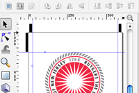



 
<a href="http://twitter.com/#!/russjf" class="zocial icon twitter" style="margin:5px;">twitter</a>
<a href="http://github.com/rf" class="zocial icon github" style="margin:5px;">github</a>

I'm a software engineer living in Brooklyn. I also make music, program live 
lights, and cook. I'm currently helping people make things better at 
<a href="http://oden.io/">Oden Technologies</a>.

I also play several instruments and produce music with my band, 
<a href="http://snacks.band">Snacks Chapman</a>.

-------

  <a class="project" href="projects/rutgers-mobile-app.html">
    
    Rutgers Mobile App
  </a>

  <a class="project" href="projects/nd.html">
    
    nd
  </a>

  <a class="project" href="projects/hackru.html">
    
    HackRU
  </a>

  <a class="project" href="projects/snapchan.html">
    
    Snapchan
  </a>

  <a class="project" href="projects/renderizer.html">
    
    Renderizer
  </a>

  <a class="project" href="projects/hackfsu.html">
    
    HackFSU
  </a>

  <a class="project" href="projects/music.html">
    
    Music
  </a>

  <a class="project" href="projects/tsm.html">
    
    tsm
  </a>

  <a class="project" href="projects/essay-beefer.html">
    
    Essay Beefer
  </a>

  <a class="project" href="projects/cheapchap.html">
    
    Cheapchap
  </a>

  <a class="project" href="projects/runr.html">
    
    Runr
  </a>

  <a class="project" href="projects/keeno.html">
    
    Keeno
  </a>

  <a class="project" href="projects/mockti.html">
    
    MockTi
  </a>

  <a class="project" href="projects/nextbusjs.html">
    
    NextbusJS 
  </a>

  <a class="project" href="projects/trollnet.html">
    
    Trollnet 
  </a>

  <a class="project" href="projects/moar.html">
    
    Moar 
  </a>

-------

<ul>
   <li>{{ post.date | date_to_string }} &raquo; <a href="{{ BASE_PATH }}{{ post.url }}">{{ post.title }}</a></li>
</ul>
