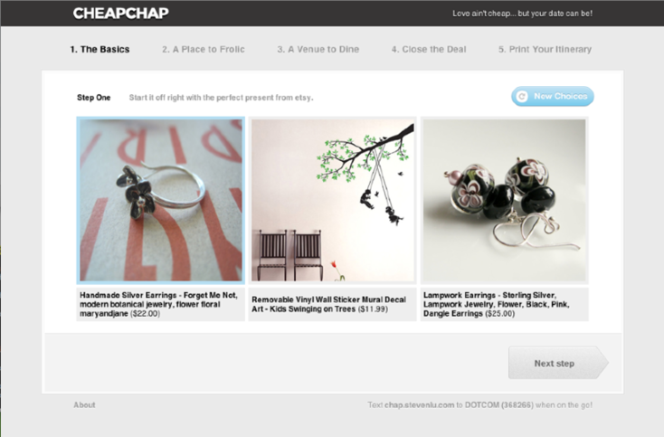
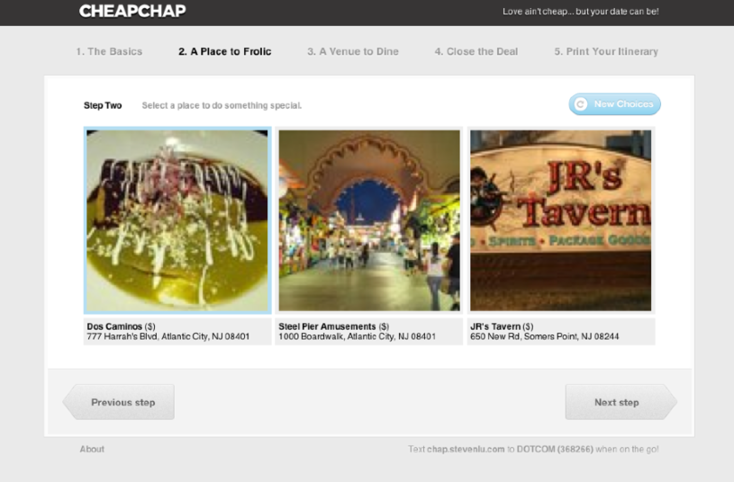
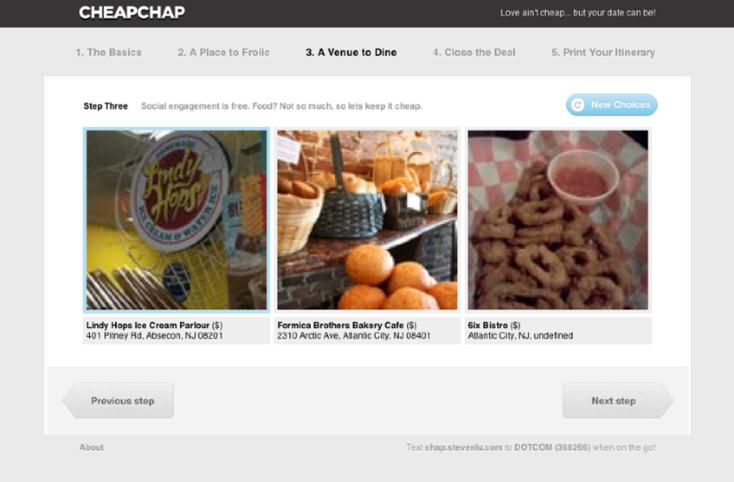



CheapChap sets you up with an affordable date solution for you and your date.
Your date may not be happy, but your wallet will be!

This is another hackathon project I made with Steven Lu, Jarek Sedlacek and 
Wayne Sun. We made it at HackNY Fall 2011. The app was built using Node.js, 
express, and mongodb.

Source available [on Github here](https://github.com/rf/hacknyf2011).

