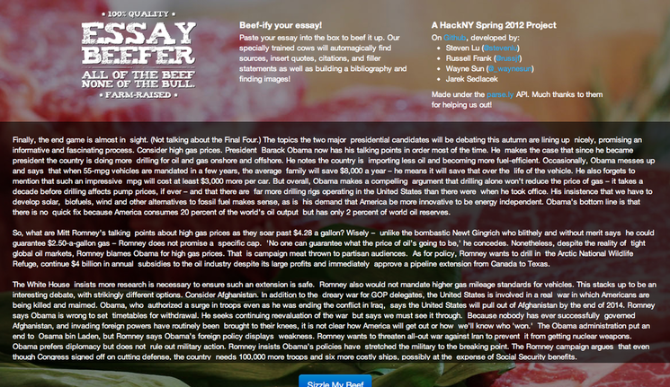
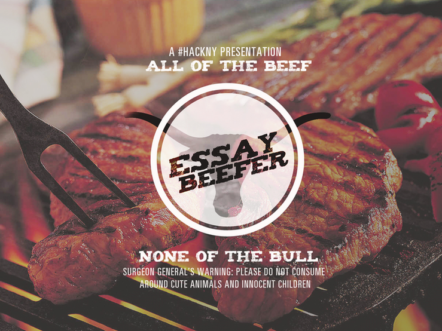



*codeigniter php, html/css, javascript*

Essay Beefer was a hackathon project at HackNY Spring 2012. It takes an essay
and tries to 'beef it up' by finding relevant articles and inserting in
quotes and citations and by finding related pictures and inserting them into
the document.

I worked on it with Steven Lu, Wayne Sun and Jarek Sedlacek.

Source available [on Github here](https://github.com/sjlu/hacknys2012).

