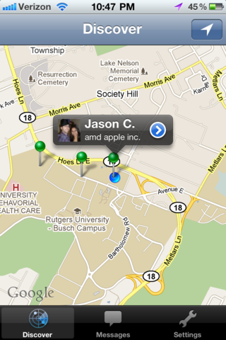



Keeno is an app which allows you to connect with people nearby who are
interested in similar things. It was made at the first HackRU, in the spring
of 2011, with Steven Lu, Wayne Sun and Jarek Sedlacek. It's somewhat
ironically similar to Tinder, which is the same idea done correctly.

