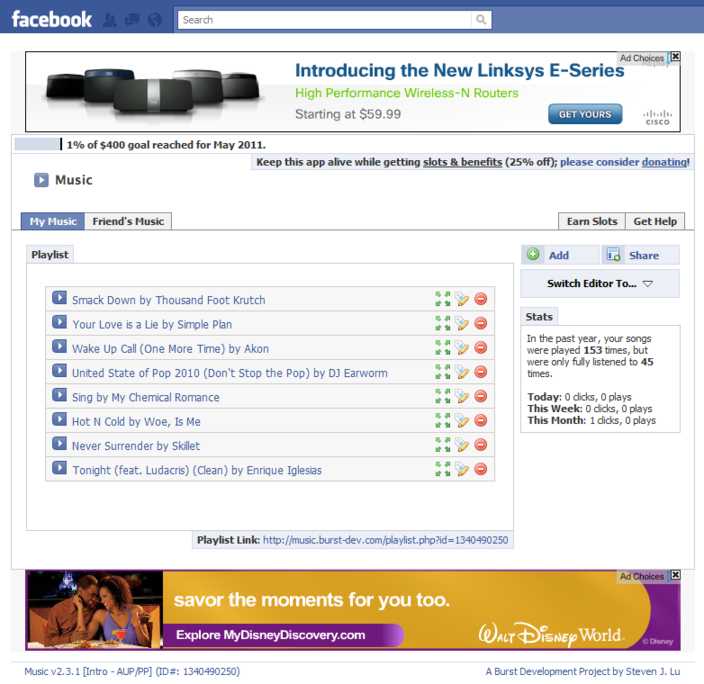
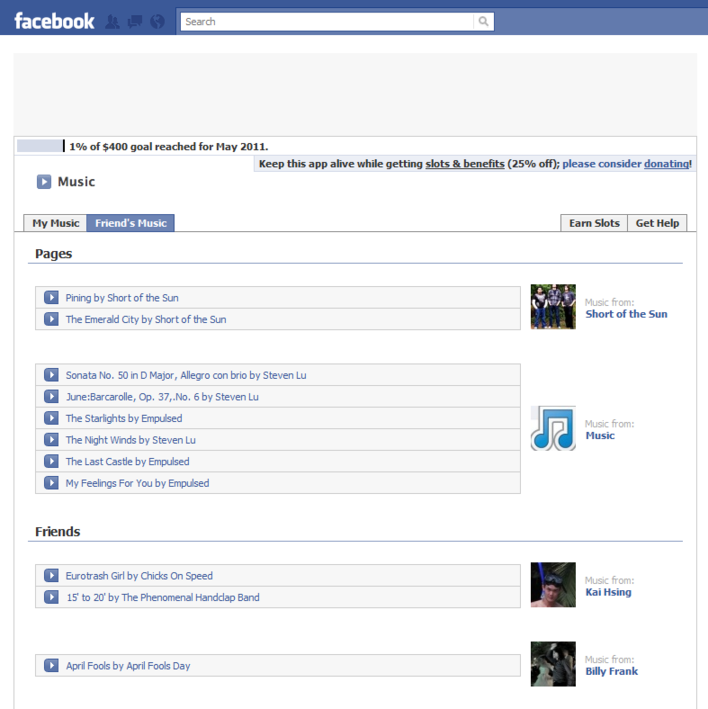
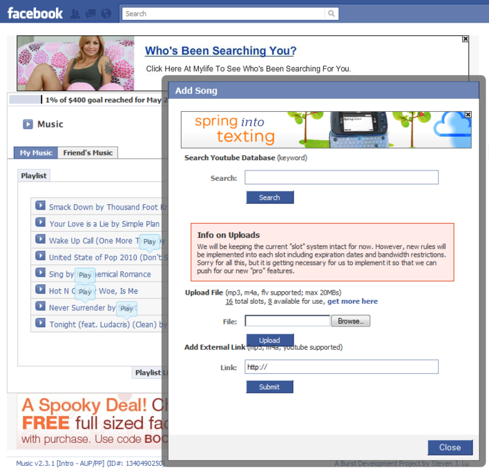
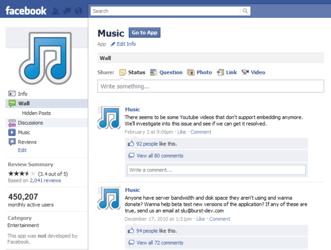
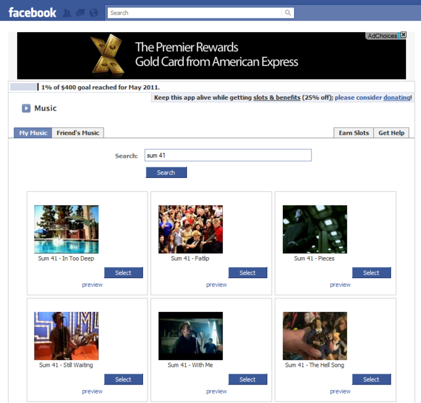



Music was an app for the Facebook platform that allowed users to place a box
on their profile containing a music player. I worked on it in high school with
[Steven Lu](http://stevenlu.com) around the summer of 2008. It was one of the
first one hundred applications to use the Facebook API.

At its peak, the application had over 8 million users with about half a million
active per month. In its most active year there were over 500 million song 
plays.

Unfortunately Facebook removed the ability for apps to put boxes on profiles,
so the app lost its main functionality, forcing it to shut down.

