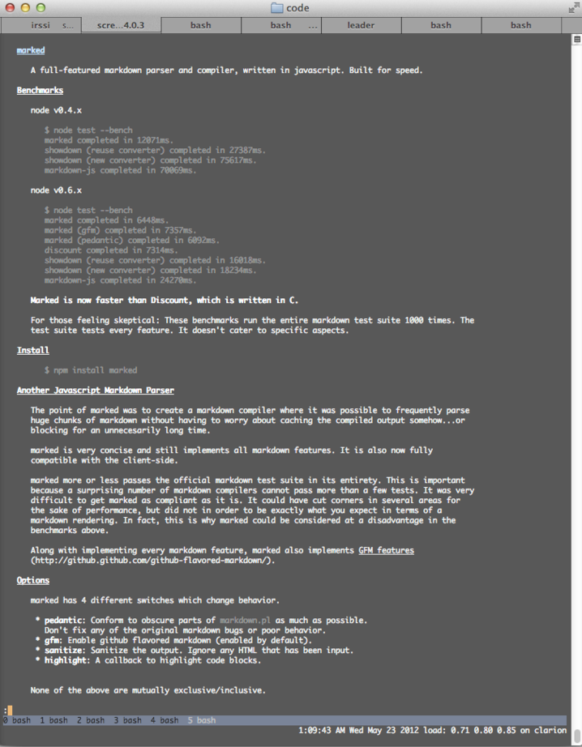



*node.js javascript*

nd is a documentation viewer for npm. It makes some assumptions about the way 
documentation is stored in npm packages; if there's a README.md it will
display it, and it can also display docs out of a `doc` directory. Check out
[the github page](https://github.com/rf/nd) for information on how the 
lookup algorithm works.

