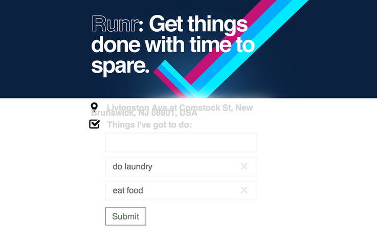
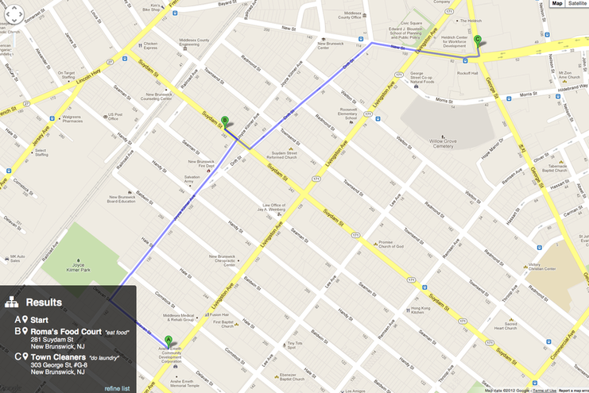



Runr solves a slight variation of the "traveling salesman" problem -- where
we need to visit 1 place of each of a few types. If you have a few errands to
run, and you want to find the places to complete those errands that are nearby
to eachother and you, Runr can solve that problem.

This was a hackathon project for Facebook's Summer of Hack 2012 with Wayne
Sun and Steven Lu.

Source code available [on Github here](https://github.com/sjlu/runr).

My main contribution to the hack, the solving algorithm, is
[available here](https://github.com/rf/nearest-category).

