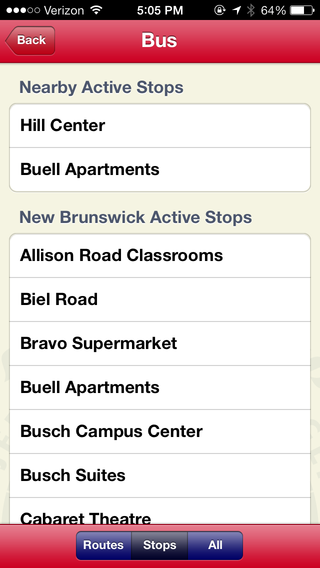



The Rutgers Mobile App was my main project at Rutgers University, where I was
employed full time from 2012 - 2014. The app was written using Appcelerator
Titanium, which allowed us to deploy to both iOS and Android within a
relatively short development period.

The app allows students to view bus times, dining hall menus, class schedules, 
building information, and more.

