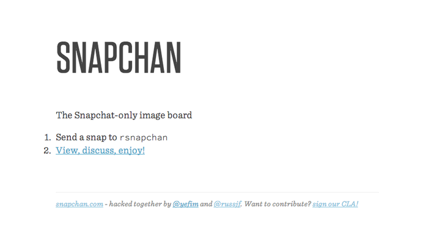



Snapchan was built at HackNY Fall 2013 with 
[Geoffrey Vedernikoff](http://twitter.com/yefim). It's a snapchat account 
which posts snapchats to a subreddit. It was built with Node.js, MongoDB, and
Iron.io within 24 hours.

The source is available [here on Github](https://github.com/yefim/snapchan).

