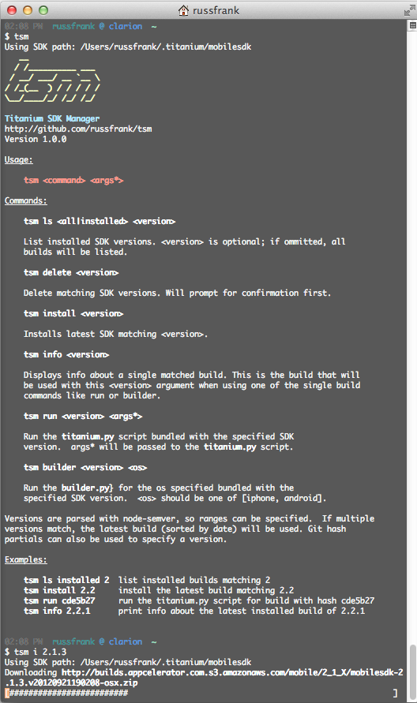



tsm is an SDK manager for Appcelerator Titanium. It can pull down and extract
the precompiled sdk builds available from Appcelerator's CI setup.

This predated the official `titanium` command line tool. When that tool came
out, it had very similar functionality, so `tsm` is now deprecated.

Source [available here](http://github.com/rf/tsm).

